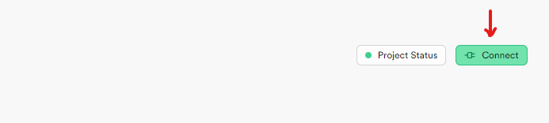

# Prueba Técnica para Desarrollador Fullstack Senior

## Prerrequisitos
- Crear una base de datos postgres en supabase https://supabase.com
- Crear una aplication en auth0 https://auth0.com

## Ejecución del proyecto
para ejecutar el proyecto en local, lo primero que se debe hacer es configurar las variables de entorno, para esto debemos crear un archivo que se llame ".env", aquí debemos asignar las siguientes variables.

### .env

DATABASE_URL: url database en supabase

DIRECT_URL: direct url database en supabase

NEXTAUTH_URL: "http://localhost:3000"

NEXTAUTH_SECRET: palabra clave para NEXTAUTH, es cualquier palabra.

AUTH0_SECRET: palabra clave para JWT, es cualquier palabra

AUTH0_BASE_URL: "http://localhost:3000"

AUTH0_ISSUER_BASE_URL: variable que sacas de la configuración de tu aplicación de auth0

AUTH0_CLIENT_ID: variable que sacas de la configuración de tu aplicación de auth0

AUTH0_CLIENT_SECRET: variable que sacas de la configuración de tu aplicación de auth0

SECRET_KEY: palabra clave para JWT, es cualquier palabra.

para los datos de supabase cuando ya creas el proyecto vas a conect, como muestra la imagen, y luego al apartado de ORMs, seleccionar el orm prisma y ya te muestran las variables.

para los datos de auth0 vas a settings en tu aplicacion y los datos se relacionan de la siguente manera

AUTH0_ISSUER_BASE_URL: https:// + Domain,

AUTH0_CLIENT_ID: Client ID

AUTH0_CLIENT_SECRET: Client Secret

En Auth0 en la settings de tu aplicacion debes poner http://localhost:3000 en los siguientes campos 

- Allowed Logout URLs
- Allowed Web Origins

y poner http://localhost:3000/api/auth/callback/auth0 en el campo 

- Allowed Callback URLs

####

Después se debe ejecutar el comando "npm i" , para instalar los módulos.

Una vez tengamos el archivo .env listo y los módulos instalados, se debe iniciar la migración de la base de datos, para esto usamos el cli del orm Prisma, entonces debemos ejecutar el siguiente comando: 

#### npx migrate dev --name init

con esto ya tendremos creadas nuestras tablas en supabase.

Se crean 2 tablas de parametrización, por lo que una vez estén listas, las debemos llenar con la siguiente data.

- Tabla IngresosEgresosConceptos

{
  name: "ingreso",
  description: "ingreso de capital"
},
{
  name: "egreso",
  description: "gasto de capital"
}

- Tabla UserRol

{
  id: 1,
  rol: "admin"
},
{
  id: 2,
  rol: "user"
}

Estamos manejando autenticación por roles, entonces si entras por auth0 se creará un registro en tabla user, pero quedará como si fuera un rol "user" y no "admin". Entonces, para tener acceso a todos los privilegios de Admin se debe cambiar el rol del usuario en la base de datos si se entra por auth0 o crear un registro en la tabla user.

Ahora ejecutamos "npm run dev" para ejecutar el proyecto en ambiente de desarrollo y ya está en ejecución el proyecto en http://localhost:3000

## Despliegue en vercel

De la forma que este proyecto se desplegó en vercel fue hacer la integración de la cuenta de github en vercel y de forma automática vercel reconoce los repositorios de github, se seleccionó el proyecto, se configuraron las variables de entorno en vercel y ya quedó desplegado.
